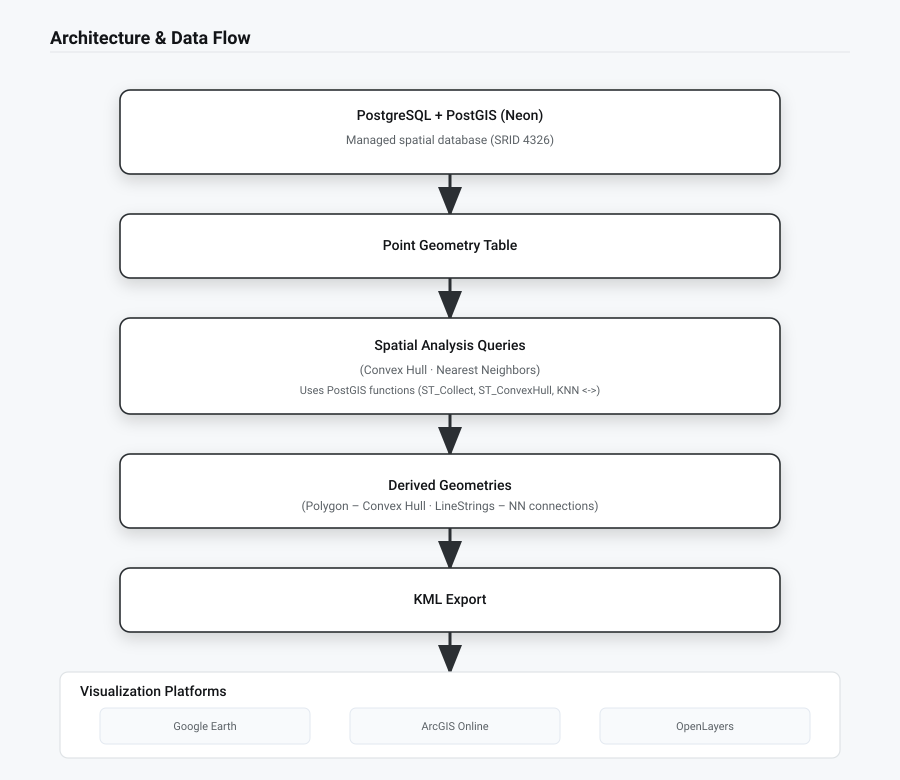
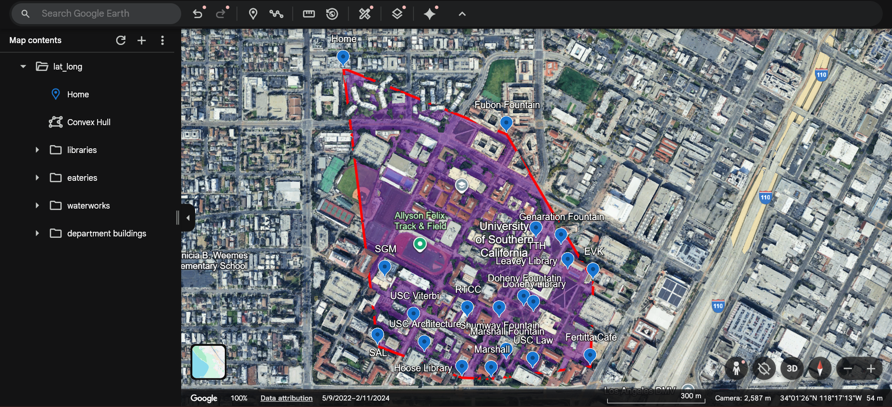
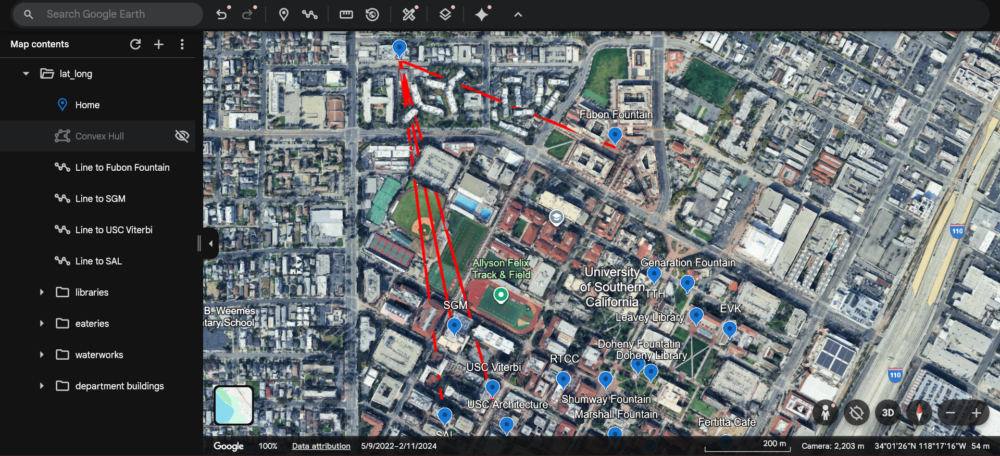
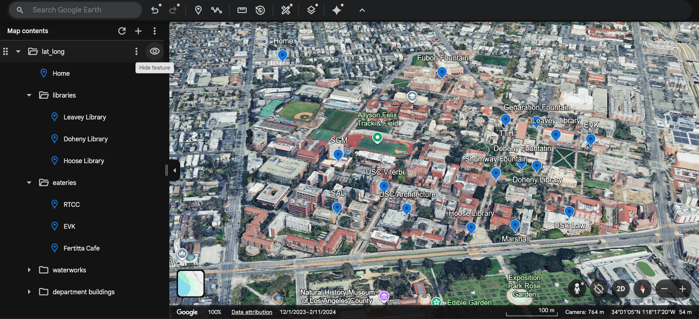
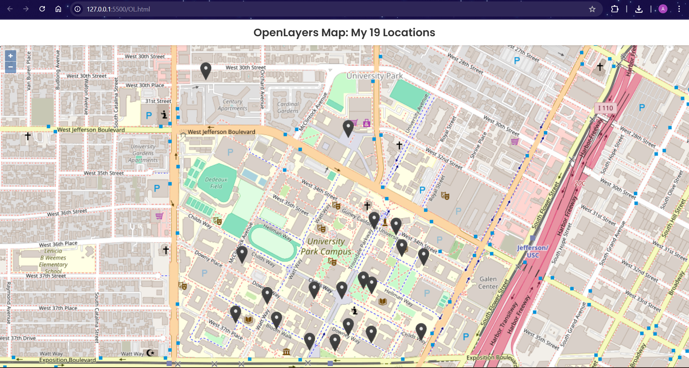

# Geospatial Analytics Pipeline 🌍

An end-to-end **geospatial analytics pipeline** built with **PostgreSQL + PostGIS**, demonstrating spatial data modeling, analysis, and visualization across multiple platforms.

---

## 🧭 Project Overview

This project showcases a complete spatial data workflow:

- Storing geospatial point data in a spatial database
- Performing spatial analysis using PostGIS
- Exporting derived geometries to interoperable formats
- Visualizing results using desktop GIS tools and web-based maps

The goal is to demonstrate **spatial reasoning**, **database-backed analytics**, and **visual validation** in a clean, reproducible system.

---

---

## 📍 Dataset

- Small set of categorized point locations
- One designated reference point
- Geometry stored as **WGS84 (SRID 4326)** points
- Data anonymized and generalized for public sharing

---

## 🗄 Database & Spatial Setup

- **Database:** PostgreSQL
- **Spatial Extension:** PostGIS
- **Hosting:** Neon (serverless PostgreSQL)

The schema defines:

- A spatial table for point geometries
- Attribute fields for naming and categorization
- Geometry column using geographic coordinates

---

## 📐 Spatial Analysis

### Convex Hull

Generates a polygon representing the minimum bounding geometry enclosing all locations.

📸 _Convex hull visualization:_

---

### Nearest Neighbors

Identifies the **four closest locations** to a reference point and generates connecting line geometries.

📸 _Nearest-neighbor connections:_

---

## 📤 Outputs & Exports

Spatial analysis results are exported as **KML**, allowing seamless use across GIS tools.

The consolidated KML includes:

- Point locations
- Convex hull polygon
- Nearest-neighbor line strings

📸 _KML viewed in Google Earth:_

---

## 🗺 Visualization

Results are explored and validated using multiple platforms:

### ArcGIS Online

Used for layer-based visualization and validation of spatial outputs.

📸 _ArcGIS Online map view:_

---

### OpenLayers Web Demo

A lightweight, client-side OpenLayers application renders the dataset directly in the browser.

- Pure HTML + JavaScript
- Uses `localStorage` for feature management
- No backend required

📸 _OpenLayers interactive map:_

---

## 🧪 Tools & Technologies

- **PostgreSQL**
- **PostGIS**
- **Neon (Serverless PostgreSQL)**
- **KML**
- **OpenLayers**
- **ArcGIS Online**
- **Google Earth**

---

## ♻ Reproducibility Notes

- SQL scripts document schema setup and spatial analysis logic
- The hosted database is not publicly exposed
- Visual outputs and screenshots serve as execution proof
- Pipeline can be reproduced in any PostGIS-enabled environment

---

## 🔒 Privacy & Anonymization

- No personal images or identifying details included
- Location names generalized
- Repository is designed for **technical demonstration only**
